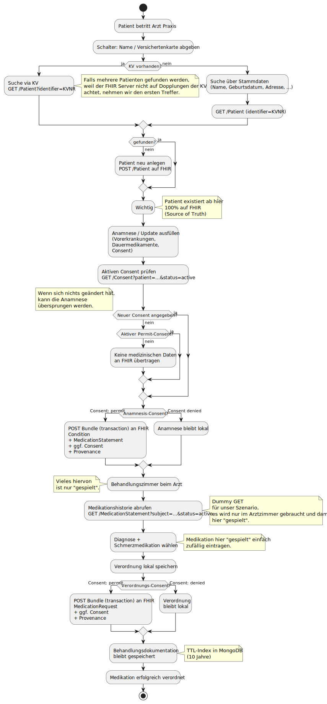
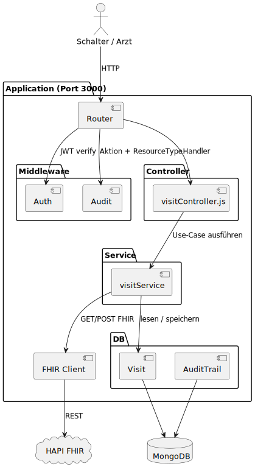

# Medikation-eRezept-slice

RESTful backend for the medication/ePrescription project.

## Wichtig
Y steht zwar auf Miro als Gruppenmitglied, hat sich aber entschieden nicht an der Gruppe teilzunehmen. 
Dies wurde im privaten chat abgesprochen.

### Hinweis zur Gruppenarbeit
X und Z haben dieses Repo gemeinsam erarbeitet und an einigen Stellen Co-Working und Pair-Programming betrieben.
Die Leistung verteilt sich somit auf etwa 50 / 50.

## Anforderungen an das Projekt und unsere Grundlagen

Damit man unseren Code versteht, müssen zuerst einige grundlegende Grundsteine gelegt werden.
Auf diesen Grundsteinen baut die gesamte Architektur des Services auf.

### 1. FHIR als einzige Source of Truth

Wir können uns an **keiner** Stelle im Prozess darauf verlassen, dass lokal gespeicherte Patientendaten aktuell sind.
Das ist uns recht früh aufgefallen, als wir die Abläufe durchgesprochen haben. 
In der Praxis kann es jederzeit dazu kommen, dass eine andere Praxis oder ein anderer Betreiber neue Daten für einen Patienten auf FHIR hinterlegt.
Wie gehen wir damit um?

Wir haben uns dazu entschieden, **FHIR als einzige Source of Truth** zu nehmen.
Lokal halten wir ausschließlich Referenzen auf FHIR-Ressourcen – niemals Kopien der eigentlichen Patientendaten.
Dadurch sind wir gezwungen, die Daten auf FHIR aktuell zu halten und nur diesen zu vertrauen. Ein Abgleich veralteter lokaler Kopien entfällt.

### 2. Eigene IDs statt übernommener Ressourcen-IDs

Obwohl wir FHIR-Referenzen speichern, werden diese **nicht für die interne Logik** verwendet, da wir nach folgendem Prinzip immer eigene IDs vergeben müssen:

> "Der Medication Service MUSS übermittelte id-Werte von Ressourcen im Rahmen einer Operation verwerfen und stattdessen eine neue ID vergeben, die im weiteren Verlauf der Operation verwendet wird." — [gematik: ePA Medication, General Principles](https://gemspec.gematik.de/ig/fhir/epa-medication/1.3.1/general-principles.html)

Das hat uns dazu bewegt, eine **eigene `Visit`-Schema-Klasse** zu erstellen, die alle relevanten Daten unter einer selbst vergebenen `visitId` (via `nanoid`) verknüpft.
Der `Visit` ist damit unser interner Anker. Die FHIR-IDs bleiben reine Referenzen nach außen für einen schnellen lookup. 

### 3. Consent-gesteuerter Datenfluss (DSGVO)

Ergänzend haben wir die DSGVO nach für uns relevanten Inhalten durchsucht. Daraus folgt: Anamnesedaten werden **nur mit gültigem Consent** an FHIR übertragen.

* Bei `permit` wird die Anamnese als **Transaction-Bundle** (Condition + MedicationStatement + Consent) an FHIR gesendet.
* Bei `deny` wird **nur** eine Consent-Ressource geschrieben – keine medizinischen Daten.

### 4. Gesetzliche Aufbewahrungsfrist

Aus dem Behandlungsvertragsrecht (eng mit der DSGVO verzahnt) ergibt sich die zehnjährige Aufbewahrungspflicht:

> "Der Behandelnde hat die Patientenakte für die Dauer von zehn Jahren nach Abschluss der Behandlung aufzubewahren, soweit nicht nach anderen Vorschriften andere Aufbewahrungsfristen bestehen." — [§ 630f Abs. 3 BGB](https://www.gesetze-im-internet.de/bgb/__630f.html)

Umgesetzt haben wir das über einen Index in MongoDB: Visits löschen sich automatisch zehn Jahre nach ihrer Erstellung (`expireAfterSeconds` auf `createdAt`).

### 5. Nachvollziehbarkeit durch Audit-Trail

Jede API-Operation wird protokolliert (Akteur inkl. Rollen, Aktion, Ressourcentyp, betroffene Ressourcen- bzw. Patienten-Referenz, HTTP-Methode und Statuscode).
Das setzt den Gedanken der FHIR-`Provenance`/`AuditEvent`-Ressourcen ("wo kommen die Daten her, wer hat was getan?") auf Anwendungsebene um.
Wir haben uns an dieser Stelle dagegen entschieden die FHIR Audits zu verwenden, da wir lieber ein internes Audit haben wollten und das FHIR Audit keine Pflicht darstellt. 

### 6. Pseudonymisierung der KV-Nummer

Bei Grundsatz 1 ist uns aufgefallen, dass wir uns an einer Stelle selbst widersprechen: Die KV-Nummer stand bei uns im Klartext in der Datenbank, obwohl sie ein direkt identifizierendes Merkmal ist.

Ganz weglassen konnten wir sie aber nicht, weil wir beim Anlegen eines `Visit` prüfen müssen, ob die KV-Nummer schon existiert.
Für diesen Vergleich macht es allerdings keinen Unterschied, ob der Wert im Klartext oder gehasht vorliegt – gleiche Eingabe ergibt immer den gleichen Hash.
Somit für unseren Zweck perfekt. 

Gespeichert wird deshalb nur noch `kvHash`. Gehasht wird erst direkt vor dem Schreiben in die Datenbank (`util/dbHelpers.js`) – vorher braucht der Service die echte KV-Nummer noch für die Patientensuche auf FHIR.

Wir benutzen **HMAC-SHA256**. Dabei fließt zusätzlich ein geheimer Schlüssel in den Hash ein, der sogenannte Pepper (`kv.hash`).
Der liegt als Datei beim Code und nicht in der Datenbank. Ohne ihn kann man die Hashes gar nicht erst nachbauen, das Durchprobieren bringt also nichts mehr.

### Ableitung der Architektur

Bereits früh im Projekt haben wir ein erstes UML für den Ablauf in der Arztpraxis vorbereitet, das für uns logisch erschien und an dem wir uns über die gesamte Projektlaufzeit orientiert haben:



Aus diesen Grundsteinen und dem Ablauf entstand die folgende Schichtenarchitektur (Router → Middleware → Controller → Service → FHIR-Client / DB):



## Setup
Es müssen ein private.key, ein public.key und ein kv.hash im repo liegen. 
Diese können über die unteren Befehle erzeugt werden. 

## Prerequisites
* Node.js
* Docker Desktop
* Git

Yarn is already included via Corepack.

## Generate the PUBLIC_KEY and PRIVATE_KEY

### PRIVATE_KEY
````bash 
openssl genrsa -out ./private.key 4096
````

### PUBLIC_KEY
````bash 
openssl rsa -in ./private.key -pubout -outform PEM -out ./public.key
````

## Generate the KV_PEPPER

Geheimnis Pseudonymisierung KV
````bash 
openssl rand -hex 32 | tr -d '\n' > ./kv.hash
````

## Project setup

```bash
corepack enable
yarn install
```

## Start MongoDB

```bash
yarn mongodb
```

## Start the backend

```bash
yarn start:dev
```

## Access Endpoints via Swagger UI

Use ```http://localhost:3000/swagger/```

## Mongo Express Dashboard
via http://localhost:8081
user: admin
password: pass
